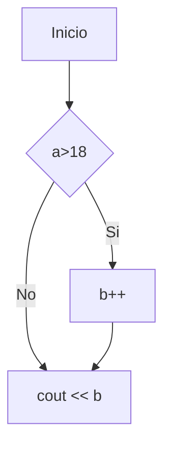
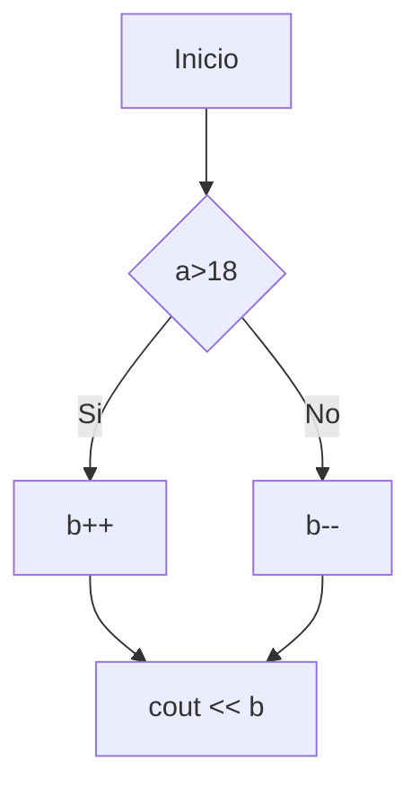
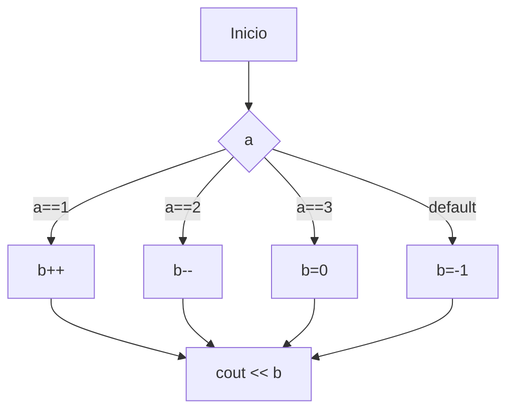
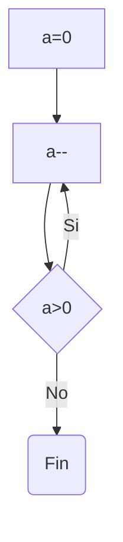
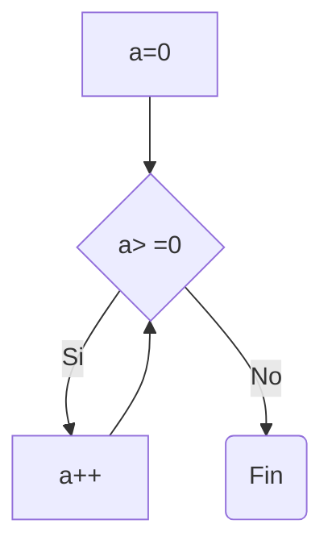
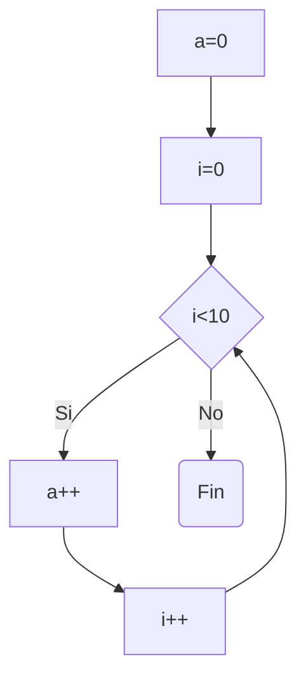
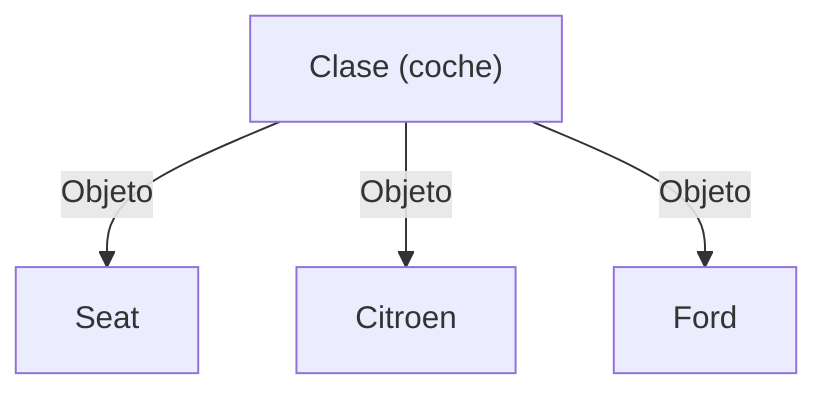

---
# You can also start simply with 'default'
theme: seriph

# random image from a curated Unsplash collection by Anthony
# like them? see https://unsplash.com/collections/94734566/slidev

# some information about your slides (markdown enabled)
title: C++
colorSchema: light
info: |
  Presentacion acerca del lenguaje de programación C++.
  Por make Classic Games (https://twitch.tv/makeclassicgames)
  Hecho con https://sli.dev
  
# apply unocss classes to the current slide
class: text-center
# https://sli.dev/features/drawing
drawings:
  persist: false
# slide transition: https://sli.dev/guide/animations.html#slide-transitions
transition: slide-left
# enable MDC Syntax: https://sli.dev/features/mdc
mdc: true
# open graph
# seoMeta:
#  ogImage: https://cover.sli.dev
level: 2
---

# Introducción a C++
## Make Classic Games


<div @click="$slidev.nav.next" class="mt-12 py-1" hover:bg="white op-10">
  Presiona Espacio para continuar <carbon:arrow-right />
</div>


<!--
The last comment block of each slide will be treated as slide notes. It will be visible and editable in Presenter Mode along with the slide. [Read more in the docs](https://sli.dev/guide/syntax.html#notes)
-->

---
transition: fade-out
level: 2
---

# Índice

<Toc minDepth="1" maxDepth="1" />


<!--
You can have `style` tag in markdown to override the style for the current page.
Learn more: https://sli.dev/features/slide-scope-style
-->

<style>
h1 {
  background-color: #2B90B6;
  background-image: linear-gradient(45deg, #4EC5D4 10%, #146b8c 20%);
  background-size: 100%;
  -webkit-background-clip: text;
  -moz-background-clip: text;
  -webkit-text-fill-color: transparent;
  -moz-text-fill-color: transparent;
}
</style>

<!--
Here is another comment.
-->

---
transition: slide-up
mdc: true
---

# Introducción

En esta presentación, vamos a hablar sobre el lenguaje de programación C++; centrándonos en su sintaxis y sus características.

<v-click>

C++ es un lenguaje de propósito general que fue establecido como una extensión 
del lenguaje C con varias características extra como la orientación a objetos.

C++ es Multiplataforma, de alto nivel (aunque puede trabajar a bajo nivel) y fuertemente tipado.


<figure class="text-center italic">Logo C++</figure>

</v-click>

---
level: 2
---

## Hola Mundo

Vamos a ver el hola mundo para C++; así veremos lo más básico de su sintaxis.


```cpp{*|1|2|4|5-6|5|6|7}{lines:true}
#include <iostream>
using namespace std;

int main() {
  cout << "Hello World!";
  return 0;
}
```
<v-click>

Podemos usar el compilador GCC ( concretamente ```g++``` ) para compilar este programa. 

Los ficheros de código de C++ tienen extensión ```.cpp```.

```bash
g++ holamundo.cpp -o hola
```
</v-click>

---
layout: two-cols
---

# Variables y Constantes


Vamos a ver la sintaxis básica de este lenguaje; recuerda que tiene mucha similitud con C ya que C++ Nació como una extensión de este.


La sintaxis para crear una variable es:

```cpp
int a = 0;
```

Donde:

* Tipo de dato: el tipo de la variable (```int```).
* nombre de la variable: Nombre que tendrá la variable.
* Inicialización: inicialización de la variable usando el operador ```=```.

**Recuerda:** Todas las instrucciones en C y C++ (excepto inicio y fin de bloque ```{``` ```}```), acaban en ```;```.

::right::

Los tipos de datos básicos de C++ son:

* ```int```: Entero.
* ```long```: Entero largo.
* ```char```: Caracter.
* ```float```: Número decimal simple.
* ```double```: Número decimal doble.
* ```bool```: Booleano (```true``` o ```false```).

Por otro lado, si se añade la palabra reservada ```const```; esta variable parasará a ser una constante y no podrá cambiar su referencia o valor.

```cpp
 const int a = 3; 
```

---
layout: two-cols
---
# Operadores

## Operadores matemáticos

* ```+```: Suma.
* ```-``` : Resta.
* ```*```: Producto.
* ```/```: Cociente.
* ```%```: Módulo (resto),

## Operadores de asignación

* ```=```: Asignación.
* ```+=```: Operador de asignación con Suma (Añade un valor a la variable actual).
* ```-=```: Operador de asignación con Resta (Resta un valor a la variable actual).

::right::

* ```++```: Incremento.
* ```--```: Decremento.

## Operadores Comparación

* ```= =```: Igual que
* ```>```, ```> =```: Mayor / Mayor o igual.
* ```<```, ```<```: Menor o igual.
* ```! =```: Distinto de.

## Operadores Lógicos

* ```&&```: And
* ```||```: Or
* ```!```: Not

---

# Comentarios

Podemos encontrar diferentes tipos de comentarios.

**Recuerda**: Un comentario es una parte del código que no será tenida en cuenta por el compilador.

* ```//```: Comentario de línea.
* ```/* */```: Comentario de bloque.

---

# E/S por teclado/Pantalla

C++ incorpora el operador ```>>``` o ```<<``` que son los operadores para controlar flujos.

Por defecto, la librería estándar de C++ incorpora dos flujos ```cout```y ```cin```para trabajar con la salida y la entrada estándar (pantalla y teclado).

También existe ```cerr``` que es la salida para errores y log de error.

Veamos un ejemplo:

```cpp

int a=2,b=3;

cout << "La suma de las variables es ";
cout << a+b;
```

---

# Estructuras de control

Vamos a ver las distintas estructuras de control que tenemos disponibles en C++. Podemos encontrar de dos tipos:

* Estructuras de control Condicionales: ```ìf```, ```ìf-else```,```switch```.
* Estructuras de control repetitivas: ```do-while```,```while```, ```for```.

---
layout: two-cols
level: 2
---

## If

La estructura de control if, permite realizar una acción si se cumple una condición.

Ejemplo:

```cpp
if(a>18){
  b++;
}
cout<< b;
```

**NOTA**: Si el bloque interior solo tiene 1 instrucción, pueden obviarse las llaves.

::right::



<style>

  .mermaid{
    padding-left: 8em;
    padding-top: 3em;
  }
</style>

---
layout: two-cols
level: 2
---

## If-Else

La estructura de control if, permite realizar una acción si se cumple una condición o realizar otra en caso contrario.

Ejemplo:

```cpp
if(a>18){
  b++;
}else{
  b--;
}
cout<< b;
```


::right::



<style>

  .mermaid{
    padding-left: 8em;
    padding-top: 3em;
  }
</style>


---
layout: two-cols
level: 2
---

## Switch case

La estructura ```switch-case```, permite elegir entre varios bloques para realizar las instrucciones dependiendo del valor de una expresión.

Ejemplo:

```cpp{*|1|2-4|4|5|5-7|7|9-10|11}{lines:true}
switch(a){
  case 1:
    //Instrucciones 
    break;
  case 2:
    //Instrucciones
    break;
  ...
  default:
    //Instrucciones por defecto
}
```

**NOTA:** Si no se añade la instrucción ```break;``` se ejecutará la siguiente instrucción independiente de si se cumple o no la condición.


::right::



<style>

  .mermaid{
    padding-left: 2em;
    padding-top: 3em;
  }
</style>

---
layout: two-cols
level: 2
---

# do-while

Esta es la primera estructura repetitiva que veremos; se trata de una estructura que repite al menos 1 vez el bloque de instrucciones internos; el resto de iteraciones se realizarán, mientras que se cumpla la condición.

Ejemplo:

```cpp
a=0;
do{
  a--;
}while(a>0);
```

::right::





<style>

  .mermaid{
    padding-left: 8em;
    padding-top: 3em;
  }
</style>

---
layout: two-cols
level: 2
---

# while

La Siguiente estructura repetitiva que veremos, es el ```while```; que ejecutará mientras se cumpla la condición, las instrucciones del bloque.

Ejemplo:

```cpp
a=0;
while(a>=0){
  a++;
}
```

::right::





<style>

  .mermaid{
    padding-left: 8em;
    padding-top: 3em;
  }
</style>

---
layout: two-cols
level: 2
---

# for

La última estructura de control repetitiva que veremos, es el for; esta permite repetir unas instrucciones un número contable de veces.

Ejemplo:

```cpp
a=0;
int i=0;
for(i=0;i<10;i++){
  a++;
}
```

::right::





<style>

  .mermaid{
    padding-left: 8em;
    padding-top: 3em;
  }
</style>


---
layout: two-cols
---

# Arrays

Un array es una colección de elementos normalmente del mismo tipo que estan ordenados por un índice o posición.

En C++ y otros lenguajes, este índice siempre comienza en ```0```.

Parar declarar un array:

```cpp
int a[4]={0,1,2,3};

```

Para acceder a cada posición se utiliza un índice:

```cpp
cout << a[0]; //0
```

Escritura:

```cpp
a[0]=3;

cout << a[0]; //3
```

::right::

### Recorrer un array
Para recorrer un array, puede usarse una estructura repetitiva; por ejemplo un ```for```.

```cpp
for(int i=0;i<10;i++){
  cout<<a[i];
}
```

### Inicializar un array

Del mismo modo, se puede usar una estructura repetitiva para su inicialización.

```cpp
for(int i=0;i<10;i++){
  a[i]=i;
}
```

<style>
  .col-right{
    padding-left: 1em!important;
  }
</style>

---
layout: two-cols
---

# Enums y Structs

Vamos a ver dos elementos básicos y muy útiles en C/C++ los Enums y los Structs.

## Enum

Un enum es un "tipo" de datos que permite solo unos valores predeterminados.

Ejemplo:

```cpp
enum Colores{
  ROJO=0,
  VERDE=1,
  AZUL=2
}
```
::right::

## Structs

Un Struct es una; estructura que permite crear tipos de datos compuestos a partir de datos básicos o de otras estructuras e incluso enums.

Ejemplo:

```cpp
struct{
  int edad;
  char nombre[30]; //Cadena de caracteres
}persona;
```

Se puede acceder a los campos del struct con los siguientes operadores.

* ```.```: Cuando es una variable.
* ```- >```: Cuando es un puntero. 

---
layout: two-cols
---

# Punteros

Hasta ahora, hemos visto las variables que almacenan un valor; sin embargo, existen unas variables "especiales" llamadas punteros que no guardan un valor; sino la dirección de memoria donde esta ese valor.

Una dirección de memoria, es donde esta guardado un dato en la memoria principal de un ordenador.

Un puntero se declara con el operador ```*```.

```cpp
int * a;
```

Un puntero, puede ser un concepto complejo pero son muy útiles a la hora de trabajar a bajo nivel.

::right::

#### Operadores de punteros

Podemos encontrar 2 operadores principales de punteros.

* ```&```: Este operador devuelve la dirección de una variable:
* ```*```: Este operador devuelve el valor de una dirección.

```cpp
int b=3;
int * a = &b;
```

#### Aritmética de punteros

Una parte importante del uso de punteros, es que puede usarse como un array, y el nombre de un array es un puntero en si.

```cpp
int a[4]={0,1,2,3};
for (int i=0;i<10;i++){
  cout << a+i;
}

```

---
layout: two-cols
---

# Funciones

Una función o subprograma, no es más que un programa que es llamado desde otro, a través de unos parámetros y volviendo el control al programa que llamo a este.

Para definir una función, suele crearse en 2 partes:

Prototipo o definición:

```cpp
int suma(int,int);
```

Implementación
```
int suma(int a, int b){
  return a+b;
}
```

Llamada

```cpp
int c = suma(2,2);
```

::right::

Podemos pasar los parámetros de una función de dos formas:

**Valor**

Se usa una "copia" del valor no el propio valor.

```cpp
int c = suma(2,2);
```

**Referencia**

Se pasa una "referencia" a donde esta almacenado el valor; es decir, un puntero.
Definición función:
```cpp
void doble(int * num){
  *a=2*(*a);
}
```

Llamada:
```cpp
int a = 3;

doble(&a); //a Vale 6
``` 

---
layout: two-cols
---

# Instrucciones de preprocesado

Existen una serie de instrucciones que son utilizadas por el compilador y se utilizan entre otras, para tener el código más organizado; algunas son:

* ```#include```
* ```#define```
* ```#ifndef```
* ```#endif```
* ```#if```

Estas instrucciones no "forman" parte del lenguaje como tal pero se utilizan junto el compilador para organizar mejor el código fuente entre otras.

::right::

#### Include

Permite "incluir" otro fichero de código o de definición (cabeceras ```.h``` o ```.hpp```).

```cpp
#include <iostream> // < > es para librerias del sistema
#include "mifichero.hpp" //para librerias propias
```

#### Define

Permite crear una expresión o constante que tomará el valor definido cada vez que aparezca.

```cpp
#define PI 3.141592
```

#### If, ifndef,etc...

Existen una serie de instrucciones para poder "incluir" código dependiendo de un valor; recuerda esto se hace antes de compilar.

```cpp
#ifdef WINDOWS
#include <something_windows_related.h>
#endif
```

---

# Orientación a Objetos

C++ junto a otros lenguajes de programación, es Orientado a Objetos; por lo que tiene una serie de características que permiten usar este paradigma de la programación.

La programación orientada a objetos, permite desarrollar de forma más aproximada al mundo real; usando entre otros los conceptos de clase y Objeto.

* Una clase no es más que una plantilla que define un objeto del mundo real.
* Un objeto no es más que la materialización de una clase dando valores a esta "plantilla".



<style>

  .mermaid{
    padding-left: 15em;
    padding-top: 3em;
  }
</style>

---
level: 2
---

## Clases y Objetos

Veamos estos conceptos mejor; una clase es una plantilla que representa un objeto del mundo real; definiendo sus características y comportamientos.

En C++ se pueden crear clases y objetos; siendo el pilar fuerte de este lenguaje.

Veamos como se crea una clase:

```cpp{*|1|2|3-6|3-4|5|6|*}{lines:true}
class Persona{
  public:
    int edad;
    char nombre[30];
    void decirHola();
};
```
Para crear un objeto:

```cpp
Persona p;
```

---
layout: two-cols
level: 2
---

## Métodos y Propiedades

Las clases, pueden tener asociadas variables y funciones llamadas; propiedades y métodos.

Una propiedad es una variable que tiene un valor; se define en la clase pero cada objeto "puede" tener un valor distinto (a no se que se defina como estática).

Ejemplo:

```cpp
class Vehiculo{
  public:
    int numRuedas;
    void mostrarNumRuedas();
};
```

```numRuedas``` es una propiedad de ```Vehiculo```.

Para acceder a una propiedad se usa el operador ```.```o ```- >```.

```cpp
coche.numRuedas=4;
```

::right::

**Métodos**

Un método es una función asociada a una clase que cambia el comportamiento de un objeto al ser llamada.

En el ejemplo anterior, _mostrarNumRuedas_ es un método. Esa sería la definición o prototipo pero podemos implementarlo a parte:


El puntero ```this``` permite acceder al propio objeto.

---
level: 2
---

## Constructores y Destructores

Existen una serie de métodos especiales que permiten crear y destruir un objeto. Esto es importante ya que C++ NO tiene recolector de basura como tal.

**Constructor**

Un constructor es un método que NO devuelve nada y que se llama igual que la clase. este método es llamado cuando se crea un objeto.

Ejemplo:


**Destructor**

Se usa para liberar memoria; se llama igual que un constructor pero comenzando por ```~```.


---
level: 2
---

## Modificadores de Acceso

Habrás podido ver que hemos usado la palabra ```public```; esto se refiere a un modificador de acceso que se usan en la orientación a objetos para evitar acceder a métodos o propiedades no disponibles.

En C++, existen los siguientes modificadores de acceso:

* ```public```: La propiedad o método es accesible por todas las clases y métodos externos.
* ```private```: La propiedad o método solo es accesible por la clase que pertenece.
* ```protected```: La propiedad o método solo es accesible por la propia clase y por su sucesores (herencia).

Podemos declarar el modificador de acceso varias propiedades a la vez sin necesidad de indicarlo en cada una.


---
level: 2
---

## Encapsulamiento

Existe una forma de poder acceder o utilizar las variables ```privadas```; en este caso se utiliza el encapsulamiento y es a través del uso de métodos publicos que si pueden acceder a las propiedades de las clases.

El caso más común es el uso de Getters y Setters.


---
layout: two-cols
level: 2
---

## Herencia

Una de las propiedades más importantes de la Orientación a objetos es la Herencia; esta característica permite realizar jerarquias de clases para heredar métodos o propiedades.

Veamos un ejemplo:


La clase Coche hereda de Vehiculo por lo que tendrá todas las propiedades y métodos de Vehiculo.

::right::

Es importante recordar, que solo se podrá acceder a las propiedades y métodos que tengan modificador ```public``` o ```protected```.

**Herencia Múltiple**

Otra de las caracteríticas de C++, es la herencia múltiple que permite heredar de varias clases padre.


---
layout: two-cols
level: 2
---

## Polimorfismo

El polimorfismo es otra de las grandes características de la orientación a objetos; podemos verlo como la capacidad de reimplementar una función o funcionalidad o incluso la capacidad de poder tener varias funciones o métodos con el mismo nombre.


Por ejemplo la clase Vehiculo tiene 3 constructores con diferentes parámetros.

::right::

Por otro lado, también se puede reimplementar dos métodos a través de la herencia.


En este caso, la clase Coche reimplementa el método de mostrarNumRuedas.

---

# SobreCarga de Operadores

No podemos olvidar, otro de los puntos fuertes de C++; la sobrecarga de operadores. Que permite sobrecargar los operadores para poder dar una nueva funcionalidad con objetos o tipos estructurados.

Veamos un ejemplo:


Pudiendo ahora "sumar" vehiculos:


---

# Ficheros

Por último para acabar este repaso sobre C++, gracias al operador ```<<``` y ```>>``` podemos utilizar ficheros a través de la librería estándar.


---

# Namespaces

Habrás podido ver la sentencia ```using namespace std```; en algunos ejemplos. Esta sentencia permite usar los llamados espacios de nombres o ```namespace```.

Un namespace es un conjunto de clases y objetos que estan agrupados y se utilizan para organizar mejor el código. Por ejemplo el namespace ```std``` indica que forma parte de la librería standar.

Tambien podemos usar una función indicando su namespace y despues de ```::``` la función o propiedad a utilizar.


---
# Referencias

* C++: https://www.w3schools.com/cpp/default.asp
* Cpp Reference: https://en.cppreference.com/
* Presentación realizada con: https://sli.dev/
* Diagramas realizados con: https://mermaid.js.org/
